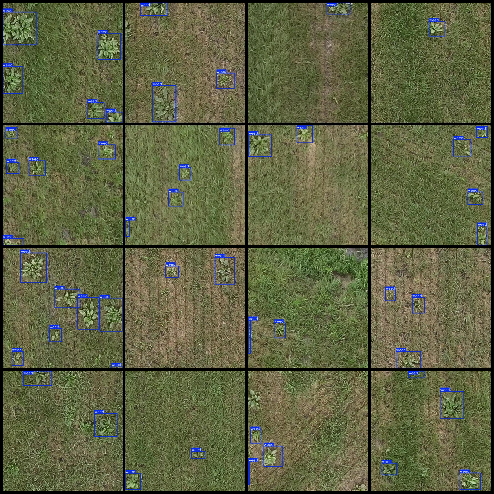
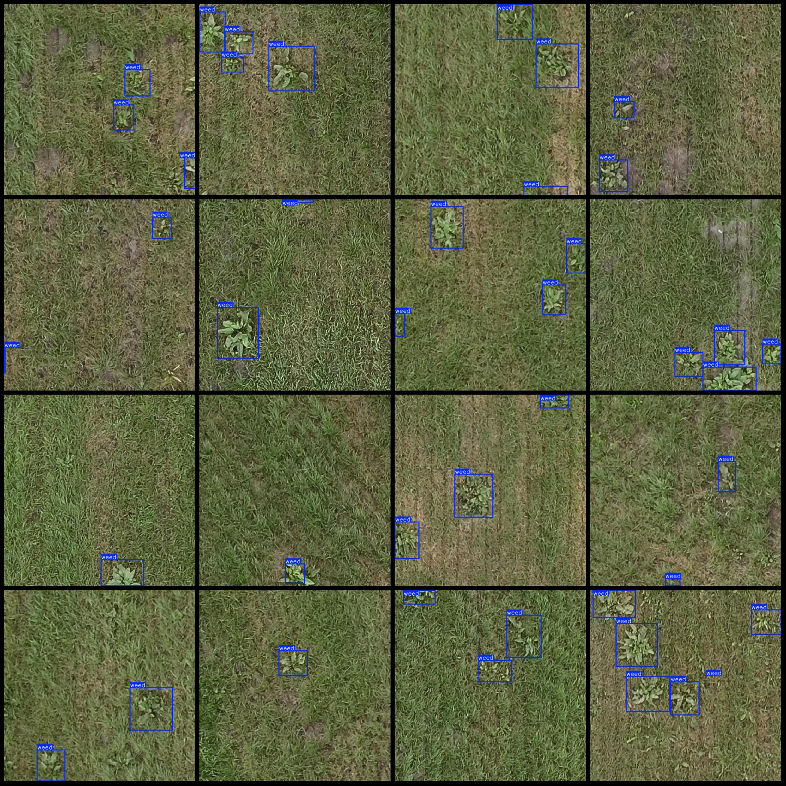
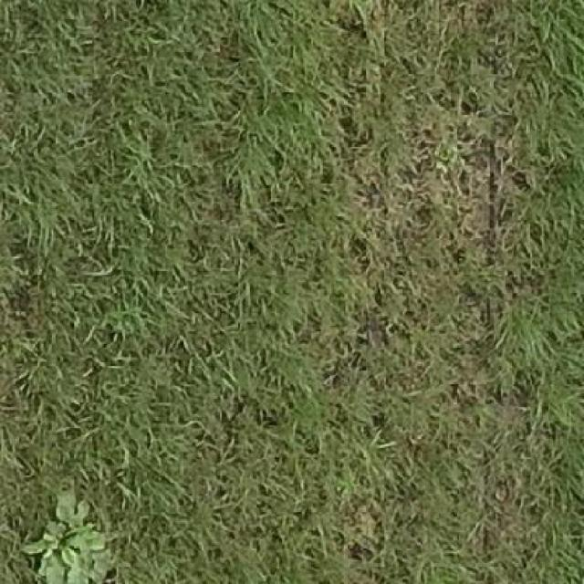
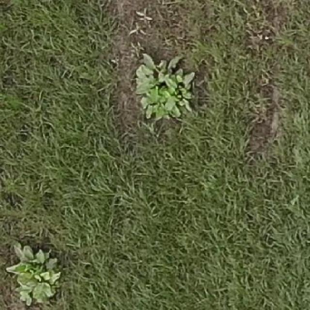
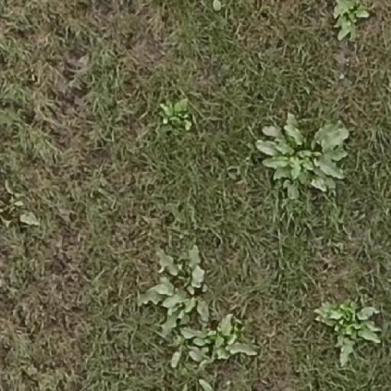

# Field Weed Detection Dataset VOC+YOLO Format with 2320 Images in 1 Category

Please note that the images in the dataset are not very clear overall. Please refer to the images below:

Dataset format: Pascal VOC format + YOLO format (excluding split paths, only containing jpg images along with corresponding VOC format xml files and YOLO format txt files).

Number of images (jpg file count): 2320
Number of annotations (xml file count): 2320
Number of annotations (txt file count): 2320
Number of annotated categories: 1
Annotated category name: ["weed"]
Number of bounding box per category:  
Weed bounding box count = 7374  
Total bounding boxes: 7374  
Number of images each category occupies:  
Weed images count = 2320  
Image resolution: 640x640  
Annotation tool used: labelImg  
Annotation rules: draw a rectangle around the category  
Important notice: The dataset does not have been divided into training, validation, or test sets; you will need to divide them yourself.
Special declaration: This dataset does not guarantee the accuracy of the trained model or weight files.
Image preview:  
Example of annotation:  
Overall clarity of the original image is similar to the one shown below:

## Images

Here is a pay link on Stripe ( https://buy.stripe.com/3cs8yP7sY87d0vu9AB ). Please contact me lonlonago@foxmail.com after funding $89, and I will send you a complete data files , thank you!

